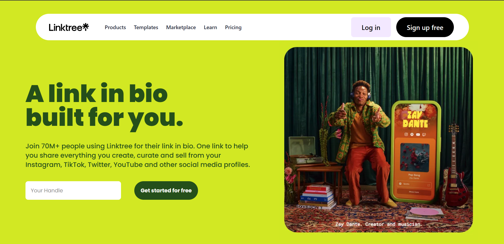

🌐 Linktree Clone

A minimalist, authentication-free Linktree alternative built with Next.js, TypeScript, and Tailwind CSS. Perfect for showcasing your social profiles, portfolio, or personal links in a clean, mobile-optimized layout.

🚀 Features

🔗 Display multiple links on a single page

🖼️ Customizable profile picture and bio

🎨 Responsive design with Tailwind CSS

⚡️ Fast development with Next.js

🧠 Fully typed with TypeScript for maintainability

🚫 No authentication required — just deploy and go

🛠️ Tech Stack
Tool	Purpose
Next.js	React framework for SSR & routing
TypeScript	Static typing for reliability
Tailwind CSS	Utility-first styling
Vercel	Deployment platform
📸 Preview

Add a screenshot or GIF of your app here

📂 Project Structure
src/
 ┣ components/
 ┃ ┣ Header.tsx        # Profile header with avatar and bio
 ┃ ┣ LinkCard.tsx      # Individual link card component
 ┃ ┣ LinkList.tsx      # List of all links
 ┃ ┗ Footer.tsx        # Optional footer with additional info
 ┣ pages/
 ┃ ┗ index.tsx         # Main page rendering all components
 ┣ public/
 ┃ ┗ images/           # Profile picture and other assets
 ┣ styles/
 ┃ ┗ globals.css       # Global styles
 ┣ tsconfig.json       # TypeScript configuration
 ┗ next.config.js      # Next.js configuration

⚙️ Getting Started
1️⃣ Clone the repository
git clone https://github.com/aadil-qamri/linktree.git
cd linktree

2️⃣ Install dependencies
npm install

3️⃣ Run the development server
npm run dev

4️⃣ Open in your browser

Visit http://localhost:3000

💡 Customization

Profile Picture: Replace the image in public/images/profile.jpg with your own.

Bio: Edit the text in components/Header.tsx to update your bio.

Links: Modify the array in components/LinkList.tsx to add or remove links. Each link object should have:

title: The text displayed on the button

url: The destination URL

icon: Optional icon class (e.g., from Font Awesome
)

🚀 Deployment

Deploy your Linktree clone with Vercel:

Push your changes to a GitHub repository.

Go to Vercel
.

Click on "New Project" and import your GitHub repository.

Follow the prompts to deploy.

Your site will be live in minutes!

🧑‍💻 Author

Aadil Ansari
💼 GitHub
 • 🌐 Portfolio
 • ✉️ Email

⭐ Support

If you find this project useful, please give it a star ⭐ on GitHub!